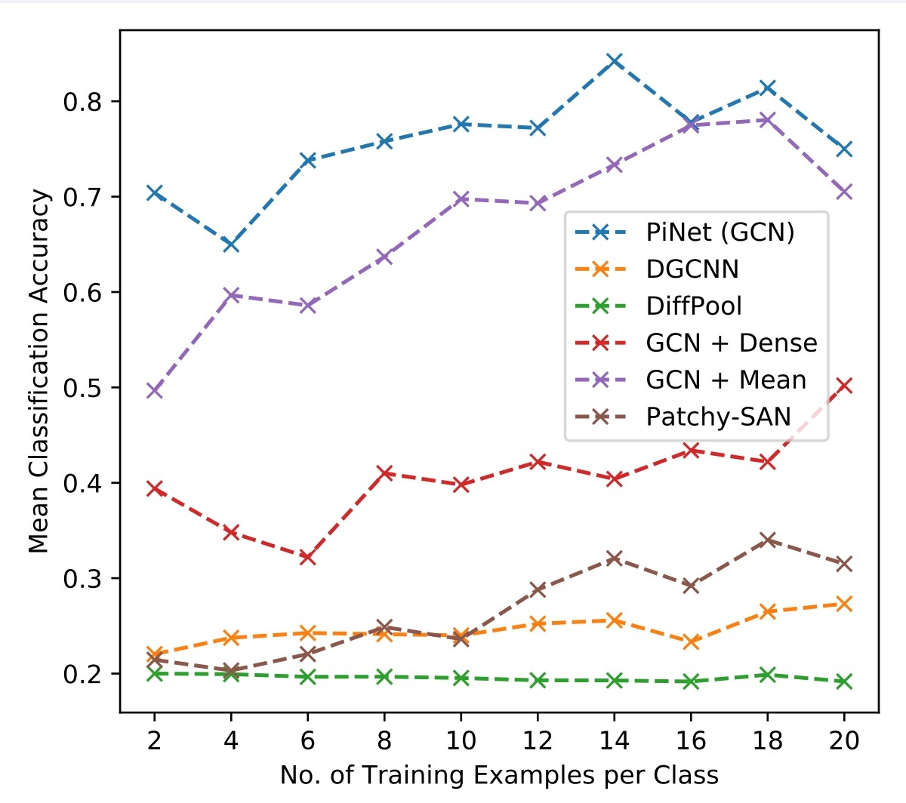
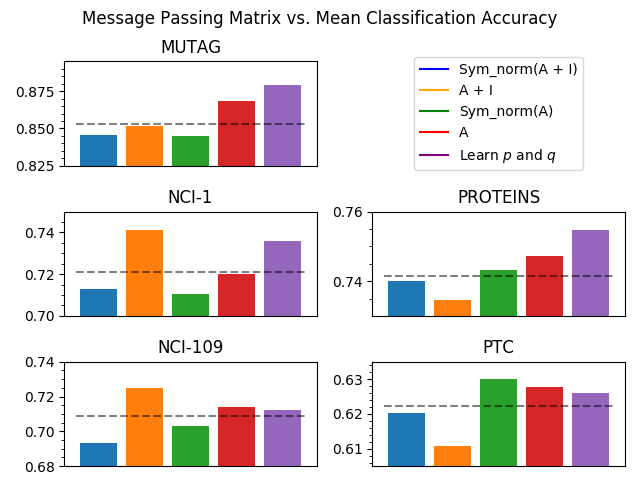
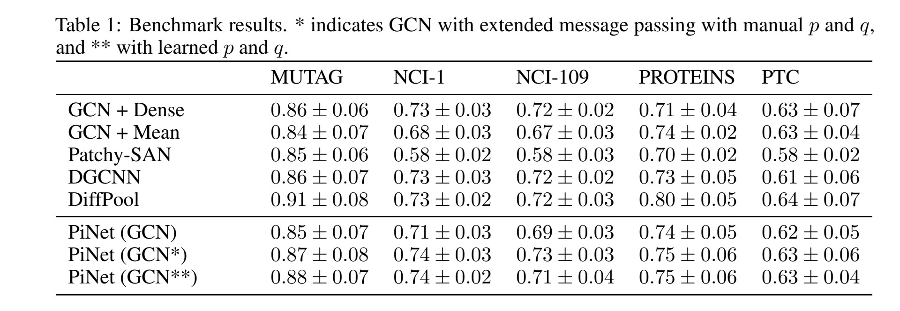

# PiNet: Attention Pooling for Graph Classification

Work on this project is ongoing and is described in detail in the original [paper](https://arxiv.org/abs/1905.03046).

If you use this work, please cite the following paper:

> Meltzer, P., Mallea, M. D. G., & Bentley, P. J. (2019). PiNet: Attention Pooling for Graph Classification, NeurIPS 2019 Graph Representation Learning Workshop

If this work is of interest to you, or you use the code, I'd love your feedback.
Please email me at p.meltzer@cs.ucl.ac.uk with any comments, criticisms or suggestions! :D

### TOC

<!-- vim-markdown-toc GFM -->

* [Example Usage](#example-usage)
    * [Building the model](#building-the-model)
    * [Data Format](#data-format)
    * [Evaluation](#evaluation)
    * [Prediction Only](#prediction-only)
* [GCN Layer](#gcnlayer)
* [Data Generator](#data-generator)
* [Experiments](#experiments)
	* [Dependencies](#dependencies)
	* [Experiment 1: Message Passing Mechanisms](#experiment-1-message-passing-mechanisms)
	* [Experiment 2: Isomorphism](#experiment-2-isomorphism)
	* [Experiment 3: Benchmark Against Existing Methods](#experiment-3-benchmark-against-soa)

<!-- vim-markdown-toc -->

## Example Usage

### Building The Model


- `out_dim_a2`: output dimension for attention
- `out_dim_x2`: output dimension for features
- `learn_pqr`: learn message passing parametrisation during training (default is `True`)
- `preprocess_A`: List of options as Strings (for manual pre-processing - 
should not be used with `learn_pqr=True`)
    - `'add_self_loops'`
    - `'sym_normalise_A'`
    - `'laplacian'`
    - `'sym_norm_laplacian'`
    - could include multiple, i.e.: `['add_self_loops', 'sym_normalise_A']`
- `tensor_board_logging`: enable logging for TensorBoard
- `reduce_lr_callback`: reduce learning rate based on validation set

```python
from model.PiNet import PiNet
from analysis.experiment2 import generate
from sklearn.model_selection import StratifiedKFold

num_classes = 3
batch_size = 5

pinet = PiNet()

folds = list(StratifiedKFold(n_splits=10, shuffle=True).split(X, Y))
```


### Data Format


- `A`: List of adjacency matrices as ndarrays
- `X`: List of features matrices as ndarrays
- `Y`: (n x 1) ndarray containing class no.

### Evaluation

- `num_classes`: number of classes
- `epochs`: default 200
- `batch_size`: default 50
- `folds`: Folds or splits of train/test ids
- `dataset_name`: default is 'dataset_name'
- `verbose`: default is 1

```pythons
accs, times = pinet.fit_eval(A, X, Y, num_classes=num_classes,
                                  epochs=50, batch_size=batch_size, folds=folds, verbose=0)
```

### Prediction only

```python
preds = pinet.get_predictions(A, X, Y, batch_size=batch_size)
```

## GCNLayer

- GCN: [model/MyGCN.py](model/MyGCN.py)
- `MyGCN` layer takes a list of `A_` and `X^{l}` as input, and gives a single output of `X^{l+1}` 

## Data Generator

- [analysis/experiment2/generate.py](analysis/experiment2/generate.py)

# Experiments

## Experiment 1: Isomorphism

params:

```python
num_nodes_per_graph = 50
num_graph_classes = 5
num_node_classes = 2
num_graphs_per_class = 100
batch_size = 5
examples_per_classes = [2, 4, 6, 8, 10]
```

- train set selected by stratified sample
- repeated 10x per `examples_per_classes`



## Experiment 2: Message Passing Mechanisms

Observe effect of various matrices for message passing/diffusion.



## Experiment 3: Benchmark Against Existing Methods

Compare against existing methods on benchmark data.



Mean classification accuracies for each classifier. For manual search the values `p` and `q` as follows: MUTAG and PROTEINS `p = 1, q = 0`, NCI-1 and NCI-109 `p = q = 1`, PTC `p = q = 0`. * indicates PiNet (both models) achieved statistically significant gain.
